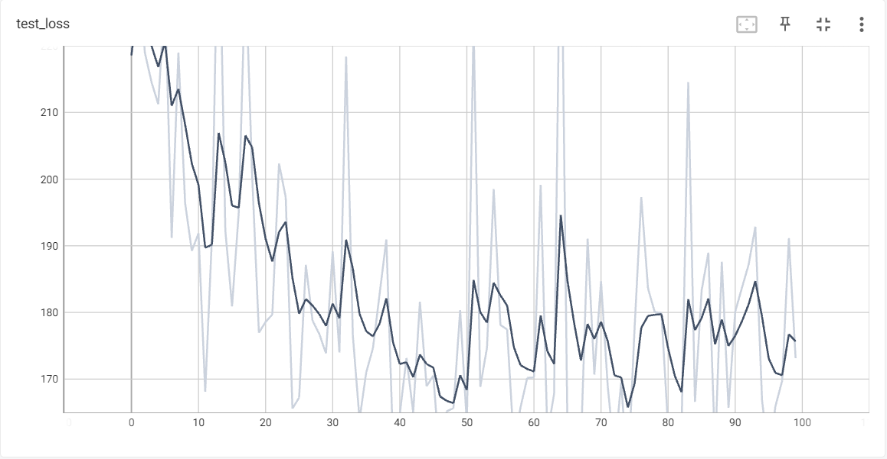
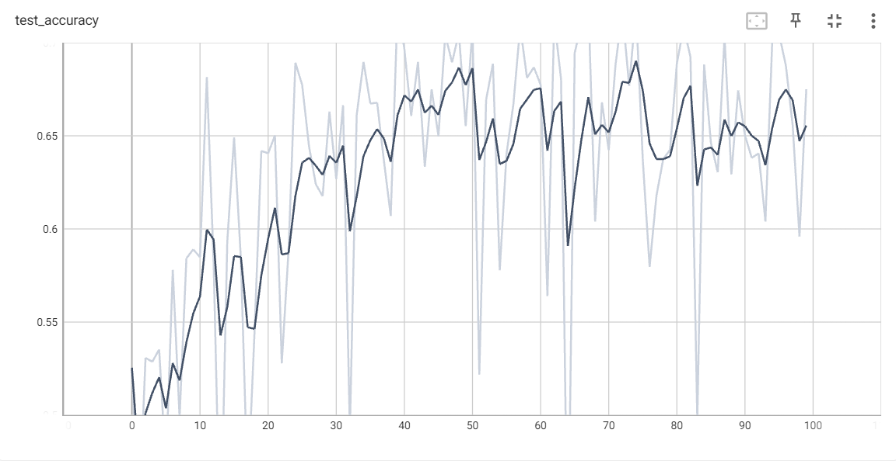

# CIFAR10
该项目为课程作业

## Dataset
CIFAR-10 是一个更接近普适物体的彩色图像数据集。该数据集是由 Hinton 的学生Alex Krizhevsky
和 Ilya Sutskever 整理的一个用于识别普适物体的小型数据集。数据集一共包含 10 个类别的 RGB 彩色图片。


每个图片的尺寸为 32 × 32 ，每个类别有 6000 个图像，数据集中一共有 50000 张训练图片和 10000 张测试图片。

## Net-ShouZheng
网络 *ShouZheng* 是由 Conv2d、 BatchNorm2d、 ReLU、 
Dropout、 MaxPool2d、 Linear以及 Flatten 层组成的简单网络。
相较于通常训练的简易网络，增加了 Dropout 层来增加网络鲁棒性。

### Result
对网络 *ShouZheng* 进行 100 轮训练，在测试集上的 loss 与 accuracy
入下图所示

 

可以看出模型在第 75 个 epoch 时，loss达到最低，accuracy达到最高(69%)。

## Dependencies

*ShouZheng* 网络依托于 pytorch 框架，可视化 loss 以及 accuracy
依托于 tensorboardX。在部分 pytorch 版本上 tensorboardX 可能不支持
可视化，使用时需要将其注释或自行替换。或者使用 tensorflow 也可对结果进行
可视化。

## Prediction
进行预测使用 `predict.py` 即可，其中各参数代表如下:

* `i`  str, 预测的图片路径
* `m`  str, 预测模型权重路径

### Option: Predict Image

Example: 预测图片airplane.png:

```
>> python demo.py -i ./examples/airplane.png -m ./src/sz_75.pth

```

### Output:

```txt
your image shape is torch.Size([3, 32, 32])
The classification of the image is airplane
```

## Training ShouZheng
训练 *ShouZheng* 请输入如下命令:
```
>> python train.py
```
## Finding
在该网络中，到最后模型的收敛不够不够理想。从模型角度讲，这可能是因为模型本身层数较少、
模型训练轮数欠缺、lr不理想等导致。从数据集角度来说，数据集本身每张图片尺寸较小也可能
是原因之一。

通过添加残差结构、更换激活函数、重新设置超参数以及选取合适的迭代器与 LOSS 是提升模型效果的途径。
